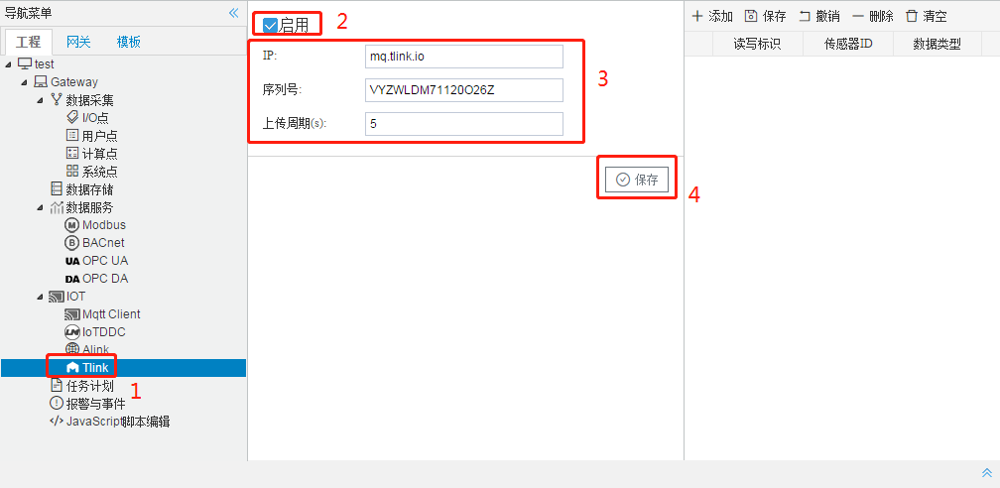

# 6.9 Tlink

用户可在Tlink页面中配置连接Tlink物联网平台。

在配置GC中Tlink页面之前，需要在Tlink的物联网平台中进行以下步骤：

1.在Tlink控制台中添加设备（设备即为网关），添加设备下的传感器。

图6-16 Tlink添加设备

链接协议：需要选择“MQTT”。

上报周期：需要设置大于在GC的Tlink页面设置的上传周期。

传感器：网关采集的数据点。

2.在设备页面点击“设置连接”按钮，可以看到该设备的序列号和设备下的所有传感器。

图6-17 Tlink设置连接

在Tlink物联网平台中进行了上述步骤之后，在GC中进行Tlink页面的配置，具体步骤如下：

1.勾选“启用”按钮，填写Tlink物联网平台设备信息中的IP和序列号，上传周期自定义。点击“保存”按钮即可完成Tlink的连接配置；

图6-18 Tlink连接配置

2.点击“添加”按钮，完成需要上传的数据点的添加。 

3.将Tlink页面中生成的传感器ID填写到对应的数据点表格当中。

图6-19 上传点配置

 

