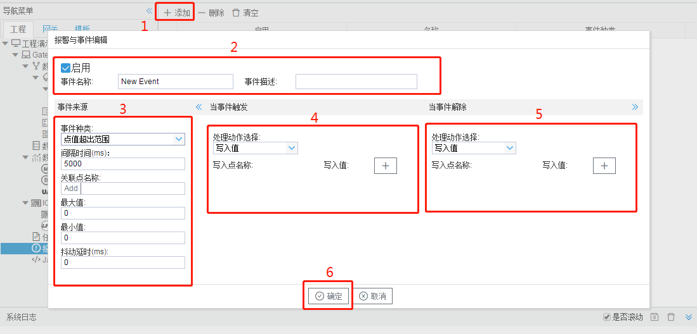

# 9.1 设置报警条件

报警与事件按照报警条件分为“点值超出范围”和“质量不为Good”两种类型，用户根据需要建立相应的报警事件。

报警事件触发和报警事件解除记录都会保存到数据库。当数据库大小超过5M时，网关缓存新的一条报警记录时，删除最早的一条报警记录。

事件编辑步骤如下：

1.  单击“添加”按钮； 

2. 编辑唯一的事件名称； 

3. 编辑“事件来源”：通过选择“事件种类”进一步填写事件参数 

   - 间隔时间：一次事件触发后，在间隔时间内不再触发相同事件。

   - 关联点名称：为I/O点、用户点、计算点和系统点中的一个点。 
   - 最大值、最小值：关联点值的范围，最小值≤当前值≤最大值为正常情况，当最小值>当前值或者最大值<当前值都会触发报警。 
   - 抖动时间：当点值超过范围或质量不为good持续的时间小于抖动时间，此时不触发事件。 

4. 编辑“当事件触发”：添加事件触发时写入的点和值，也可以“在处理动作选择”中选择“不响应”。

5. 编辑“当事件解除”：添加事件解除时写入的点和值，也可以“在处理动作选择”中选择“不响应”。 

6. 点击”确定“按钮完成事件的添加。

图8-1 事件编辑

