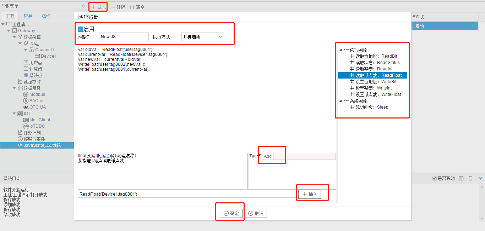

# 10.1 操作步骤

具体操作如下： 

1. 单击“添加”按钮； 

2. 在弹出的编辑框中添加唯一的js名称，执行方式总共有三种：开机运行、循环和定时。

   - 开机运行：程序启动时运行JS脚本；

   - 循环：根据配置的执行周期（ms）循环执行JS脚本；（已删除，请使用开机运行加上while(true){}）

   - 定时：每天规定的时间（时：分：秒）执行JS脚本； 

3. 单击选中需要运行的函数； 

4. 点击“Add”按钮，在弹窗中选择一个需要读取或者设置的点； 

5. 单击“插入”按钮，将新建的函数添加到js编辑框的光标后面； 

6. 可重复3,4,5的步骤进行多个函数的添加； 

7. 点击”确定“按钮完成js脚本的编辑。

JavaScript脚本编辑步骤

用户可以在编辑框中自行添加符合js语法的脚本，如while、if、else等。

