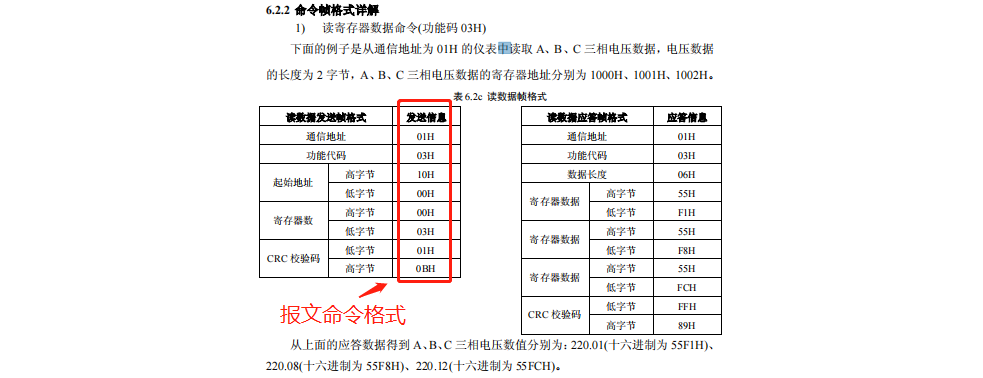
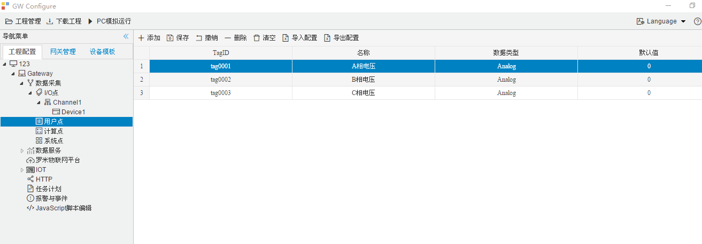
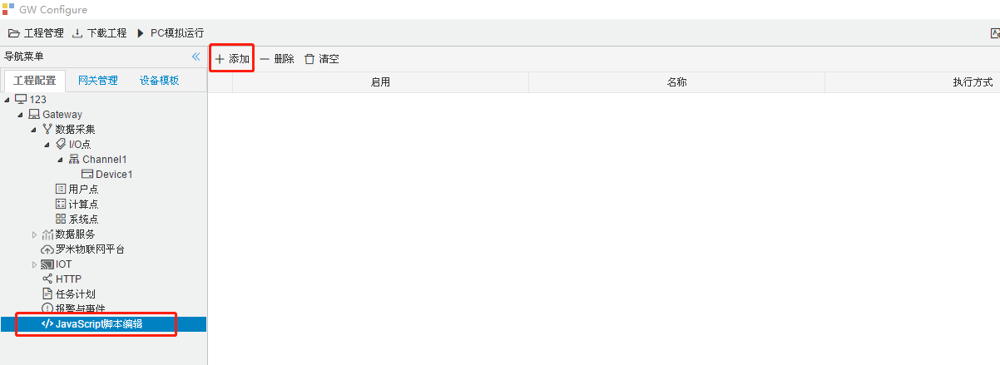
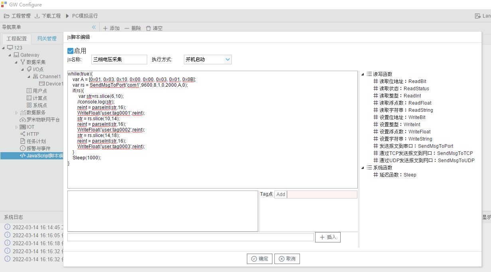
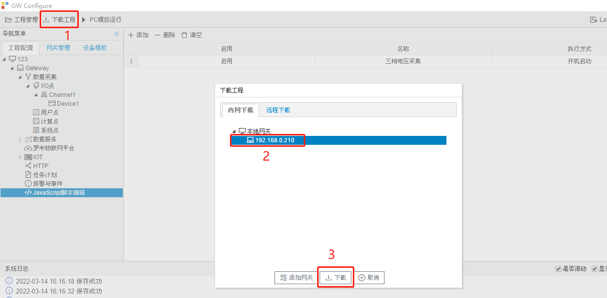

# 10.4 JS脚本自定义采集协议


　　当找不到合适的采集协议时，我们还可以通过JS脚本来自定义采集协议。

　　首先要在设备的文档上找到读寄存器数据命令，然后根据文档中命令格式向设备发送报文，设备接收到正确的命令报文后，就会返回相应格式的报文，从设备返回的报文中就可以采集到数据。

　　下图为威胜DTSD342电表的文档，可以看到采集ABC三相电压的命令报文格式如下：

　　从文档发送信息得到：01H 03H 10H 00H 00H 03H 01H 0BH   (H为16进制) 

　　从而得出命令报文为：[0x01, 0x03, 0x10, 0x00, 0x00, 0x03, 0x01, 0x0B]（0x表示16进制）

　　**注：**如果设备文档中给出的指令不是16进制的，而是一个字符串，例如：“G1” ，这时就需要把G1转成16进制的ASCII码，可以通过ASCII码表来查出“G” 和 “1”的16进制代码，见本节最底部的《ASCII 编码一览表》。

　　从ASCII 编码一览表可得： G=0x47 ，1=0x31，  所以命令报文为：[0x47, 0x31]



　　需要在配置工具中建立三个用户点，分别来放入ABC三相电压的数据。



　　单击GC中的JavaScript脚本编辑器，然后再点”添加“。





　　**SendMsgToPort函数**    向指定串口发送报文，并返回接收到的报文，参数依次为：串口号，波特率，数据位，停止位，奇偶校验（ 0:N，1:O，2:E），超时时间（单位毫秒：1000毫秒=1秒），发送的报文，等待接收的字节数。返回值为字符串型。

示例：

```js
while(true){                                                   //1个不会结束的循环
    var A = [0x01, 0x03, 0x10, 0x00, 0x00, 0x03, 0x01, 0x0B];  //报文内容
    var rs = SendMsgToPort('com1',9600,8,1,0,2000,A,0);        //向串口发送报文
    //console.log(rs);                                         //打印出返回值
    if(rs){                                                    //判断返回值是否为空
        var str=rs.slice(6,10);                                //按文档报文截取数据（A相电压）
        //console.log(str);                                    //打印出str的内容
        reint = parseInt(str,16);                              //把字符串转成int16
        WriteFloat('user.tag0001',reint);                      //把值写入指定的用户点
        str = rs.slice(10,14);                                 //按文档报文截取数据（B相电压）
        reint = parseInt(str,16);                              //把字符串转成int16
        WriteFloat('user.tag0002',reint);                      //把值写入指定的用户点
        str = rs.slice(14,18);                                 //按文档报文截取数据（C相电压）
        reint = parseInt(str,16);                              //把字符串转成int16
        WriteFloat('user.tag0003',reint);                      //把值写入指定的用户点
    }
    Sleep(1000);                                               //等待1秒后再次执行循环体
}
```


　　**SendMsgToTCP函数**    向指定网口发送指定报文，并返回接收到的报文。参数依次为：IP地址，端口，超时时间（单位毫秒：1000毫秒=1秒），发送的报文。返回值为字符串型。

示例：

```js
while(true){                                                   //1个不会结束的循环
    var A = [0x01, 0x03, 0x10, 0x00, 0x00, 0x03, 0x01, 0x0B];  //报文内容
    var rs = SendMsgToTCP('192.168.1.88',81,2000,A);           //向网口发送报文
    //console.log(rs);                                         //打印出返回值
    if(rs){                                                    //判断返回值是否为空
        var str=rs.slice(6,10);                                //按文档报文截取数据（A相电压）
        //console.log(str);                                    //打印出str的内容
        reint = parseInt(str,16);                              //把字符串转成int16
        WriteFloat('user.tag0001',reint);                      //把值写入指定的用户点
        str = rs.slice(10,14);                                 //按文档报文截取数据（B相电压）
        reint = parseInt(str,16);                              //把字符串转成int16
        WriteFloat('user.tag0002',reint);                      //把值写入指定的用户点
        str = rs.slice(14,18);                                 //按文档报文截取数据（C相电压）
        reint = parseInt(str,16);                              //把字符串转成int16
        WriteFloat('user.tag0003',reint);                      //把值写入指定的用户点
    }
    Sleep(1000);                                               //等待1秒后再次执行循环体
}
```

　　编辑好JS脚本后，单击”确定“按钮保存，然后”下载工程“到网关。




附：ASCII 编码一览表

| 十六进制 | 字符 |
| :------: | :--: |
|   0x21   |  !   |
|   0x22   |  "   |
|   0x23   |  #   |
|   0x24   |  $   |
|   0x25   |  %   |
|   0x26   |  &   |
|   0x27   |  '   |
|   0x28   |  (   |
|   0x29   |  )   |
|   0x2A   |  *   |
|   0x2B   |  +   |
|   0x2C   |  ,   |
|   0x2D   |  -   |
|   0x2E   |  .   |
|   0x2F   |  /   |
|   0x30   |  0   |
|   0x31   |  1   |
|   0x32   |  2   |
|   0x33   |  3   |
|   0x34   |  4   |
|   0x35   |  5   |
|   0x36   |  6   |
|   0x37   |  7   |
|   0x38   |  8   |
|   0x39   |  9   |
|   0x3A   |  :   |
|   0x3B   |  ;   |
|   0x3C   |  <   |
|   0x3D   |  =   |
|   0x3E   |  >   |
|   0x3F   |  ?   |
|   0x40   |  @   |
|   0x41   |  A   |
|   0x42   |  B   |
|   0x43   |  C   |
|   0x44   |  D   |
|   0x45   |  E   |
|   0x46   |  F   |
|   0x47   |  G   |
|   0x48   |  H   |
|   0x49   |  I   |
|   0x4A   |  J   |
|   0x4B   |  K   |
|   0x4C   |  L   |
|   0x4D   |  M   |
|   0x4E   |  N   |
|   0x4F   |  O   |
|   0x50   |  P   |
|   0x51   |  Q   |
|   0x52   |  R   |
|   0x53   |  S   |
|   0x54   |  T   |
|   0x55   |  U   |
|   0x56   |  V   |
|   0x57   |  W   |
|   0x58   |  X   |
|   0x59   |  Y   |
|   0x5A   |  Z   |
|   0x5B   |  [   |
|   0x5C   |  \   |
|   0x5D   |  ]   |
|   0x5E   |  ^   |
|   0x5F   |  _   |
|   0x60   |  `   |
|   0x61   |  a   |
|   0x62   |  b   |
|   0x63   |  c   |
|   0x64   |  d   |
|   0x65   |  e   |
|   0x66   |  f   |
|   0x67   |  g   |
|   0x68   |  h   |
|   0x69   |  i   |
|   0x6A   |  j   |
|   0x6B   |  k   |
|   0x6C   |  l   |
|   0x6D   |  m   |
|   0x6E   |  n   |
|   0x6F   |  o   |
|   0x70   |  p   |
|   0x71   |  q   |
|   0x72   |  r   |
|   0x73   |  s   |
|   0x74   |  t   |
|   0x75   |  u   |
|   0x76   |  v   |
|   0x77   |  w   |
|   0x78   |  x   |
|   0x79   |  y   |
|   0x7A   |  z   |
|   0x7B   |  {   |
|   0x7C   |  \|  |
|   0x7D   |  }   |
|   0x7E   |  ~   |